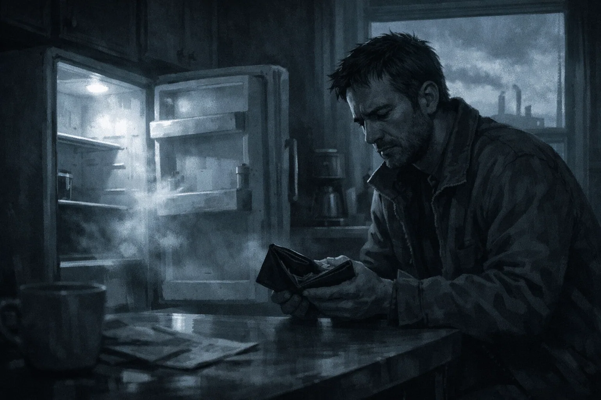
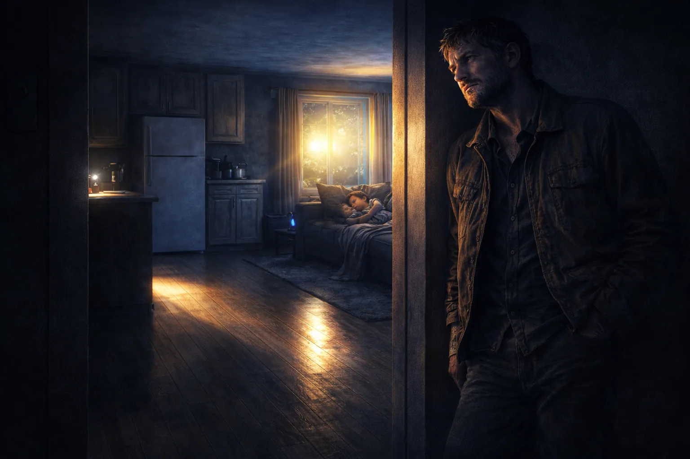

# Project 911

## About

A browser-based text adventure game set in 1990s Detroit.

You play a father caught in a series of misrouted 911 calls.
Every choice is a matter of life and death—one wrong decision can end everything.

## Features

- Choice-driven gameplay (horror / absurd)
- Browser-only (no installation required)
- No saving system — no LocalStorage, cookies, IndexedDB, or server-side persistence
- Every run is final

<p align="center">
  
  
  
</p>

## Requirements

- Node.js + npm

This project is a Vite + Vanilla JS SPA.

## Development

```bash
npm install
npm run dev
```

- `public/data/gameData.json` contains all scene / BAD END / clear data
- Put images in `public/assets/`

## Build

```bash
npm run build
npm run preview
```

Build output is `dist/`.

## Game Rules

- Starts from Scene 1
- Each scene has 2 choices (A/B)
- Exactly one route is correct
- A wrong choice immediately leads to a BAD END
- 10 consecutive correct choices leads to GAME CLEAR
- No saving: reloading restarts from Scene 1

## AI Disclosure

This project was created with assistance from generative AI tools, including parts of the source code and some of the game’s illustrations.

If you reuse or distribute this project, please review the contents to ensure they meet your requirements and do not assume AI-generated outputs are error-free.

## License

MIT (see `LICENSE`).
